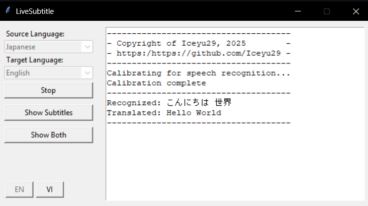

# LiveSubtitle

<div align="center">
  
</div>

LiveSubtitle provides real-time subtitles for system audio by capturing audio with Stereo Mix, transcribing it using Google's Speech Recognition API, and translating it via Google Translator. It features a customizable subtitle window, multilingual support, and an intuitive interface for accessibility and communication.

---

## ✨ Features
- **Real-Time Speech Recognition**: Captures system audio and recognizes speech using Google's Speech Recognition API.
- **Multilingual Translation**: Translates recognized speech into multiple languages using Google Translator.
- **Customizable Subtitle Display**: Adjustable subtitle window with options to show both original and translated text or only the translation.
- **User-Friendly GUI**: Intuitive interface with controls for language selection, subtitle visibility, and display modes. Support both English and Vietnamese.
- **Error Logging**: Logs errors and messages to a console for better debugging and user feedback.

---

## 📸 Screenshots
<div align="center">
  
  
</div>

---

## 🛠️ Requirements
- **Operating System**: Windows 7/8/8.1/10/11
- **Audio Driver**: Realtek Audio Driver with Stereo Mix enabled.  
  *Note*: "Stereo Mix" must be enabled to capture system audio. You can check this in your sound settings.

---

## 🚀 Getting Started

### Run Directly from Code
1. Ensure Python is pre-installed on your system.
2. Install the required Python libraries:
   ```shell
   pip install keyboard speechrecognition googletrans
   ```
3. Run the program from the source code.

### Run from Pre-Built Executable
1. Download the latest version from the [Releases Page](https://github.com/Iceyu29/LiveSubtitles/releases/latest).
2. Run the executable file.

---

## 🎛️ Enabling Stereo Mix
1. Right-click the speaker icon in the taskbar and select **Sounds**.
2. Navigate to the **Recording** tab and locate **Stereo Mix**.
3. If it's disabled, right-click and select **Enable**.

---

## 📜 License
This project is licensed under the [MIT License](LICENSE).

---

## 🤝 Contributing
Contributions are welcome! Feel free to submit issues or pull requests to improve the project.

---

## 📧 Contact
For questions or feedback, please reach out via the [GitHub Issues](https://github.com/Iceyu29/LiveSubtitle/issues) page.
